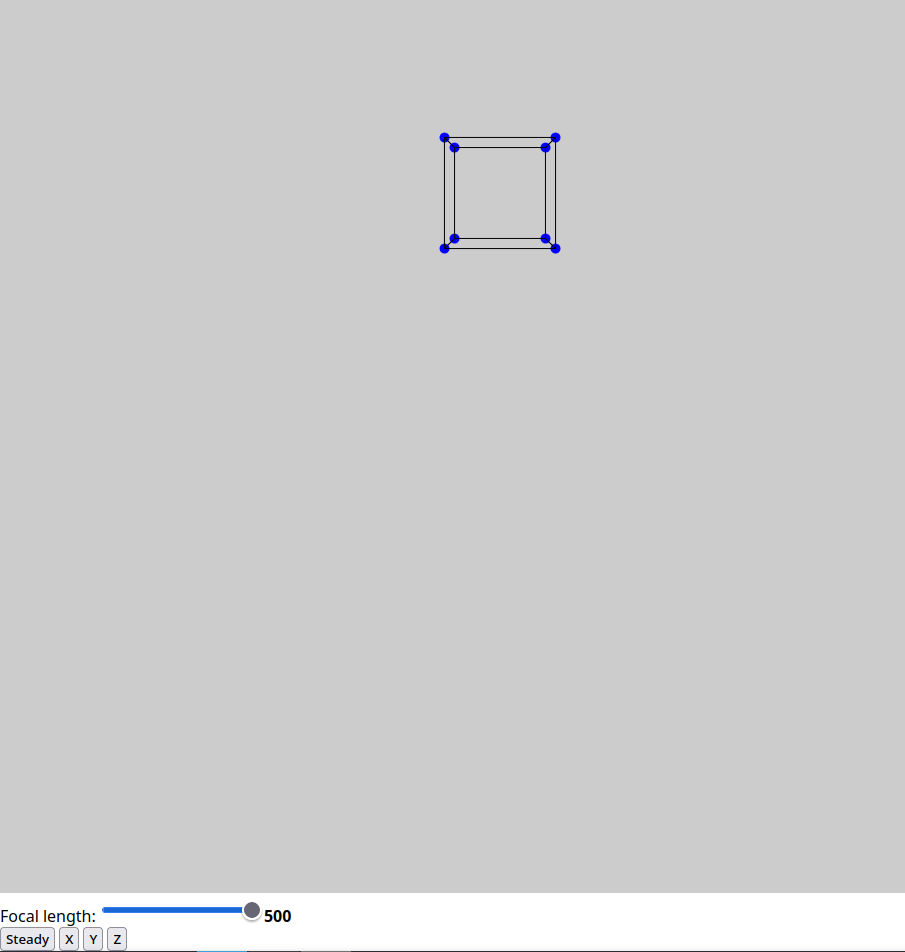
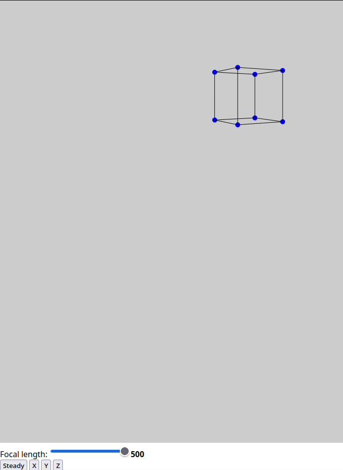

# Simple 3D Renderer
A simple 3D renderer written in Typescript. Right now, it can render a single cube, but if you want you can change the vertices and edges in the code to make the shape you want.

> Thanks to matbattwings (https://www.youtube.com/@mattbatwings) for the inspiration and for providing the me the knowledge to make this through his inspirational videos.

# Images

